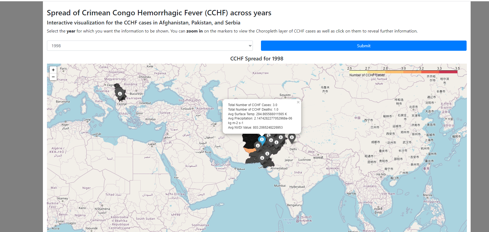

# VectorBorneDiseaseAnalysisOnSouthAsianCountriesGroup10Fall2021 #

## Description ##
A repository containing a variety scripts and data related to analyzing Crimean-Congo Hemorrhagic Fever (CCHF) Virus within the Afghanistan, Pakistan, and Serbia.

## Data Description ##
There are several data sets which are contained inside this repository and were curated from a variety of sources. These data sets can be found in the data folder under the individual_data_sets sub-folder. This sub-folder includes the following:

1. cattle_data
    1. cattle-livestock-count-heads.csv
    
    * The cattle-livestock-count-heads.csv data set contains the number of recorded cattle in a particular country for every year

2. CCHF_Data
    1. cchf_data.csv
    2. cchf_district_data.csv

    * The cchf_data.csv file contains data relating to the number of confirmed CCHF cases and deaths within a particular city/region in a particular year. 
    
    * The cchf_district_data.csv contains data relating to the number of confirmed CCHF cases and deaths within a particular city/region in a particular year within a particular district on the country.

3. original_cchf_data
    1. original_nasa_supplied_data.csv 

    * The original_nasa_supplied_data.csv file contains the original Promed data we received from NASA. The data was curated from Promed's webpage utilizing a NLP script created by Ethan Joseph which can be found here: https://github.com/sirmammingtonham/vector-borne-disease-analytics

4. population_data
    1. population_data_countries.csv

    * The population_data_countries contains the population for all countries from 1960 up to 2020

5. precipitation_data
    1. yearly_precipitation_data_by_district.csv

    * The precipitation data contains the yearly average precipiation in the known districts of a particular country

6. temperature_data
    1. temperature_data_serbia_pakistan_afghanistan.csv
    2. yearly_temperature_data_by_district.csv

    * The temperature_data_serbia_pakistan_afghanistan.csv contains the monthly average temperature for each district in a particular country in a particular year in Kelvin.
    
    * The yearly_temperature_data_by_district.csv contains the yearly average temperature for each district in a particular country in Kelvin.

7. vegetation_data
    1. The vgi_data.csv

    * The vgi_data.csv contains the yearly average NVDI value (which has been increased with a scaling factor of .0001) for a particular district in a particular country

Another sub-folder can be seen in the data directory which is the geodata directory. This directory specifically contains GeoJSON data curated from a multitude of sources for mapping countries and their districts.

The final two pieces of data located within the data directory are the following:

1. combined_district_data.csv

* The combined_district_data.csv contains all of the combined data values from our various data sources on a district level. Please note we removed any rows containing NA's

## Fetching, Parsing, and Formatting Data ##
Now there were two primary ways we collected the data inside our data sets. The first was manual collection where the team identified data which had already been collected such as, the cattle, promed, and population data. The second was utilizing python scripts to fetch, parse, and format the data into the format required for analysis. Each python script located in the data_fetching directly utilizes a similar workflow which is described below:

1. Identify the countries of interest
2. Retrieve GeoJSON files of the countries of interest
3. Identify the NASA data to pull
4. Pull down the NASA data to your local work station utilizing a file containing the links
Now the NASA data is in an older format so we had to utilize pyhdf.SD which enables us to read the older HDF formats
The data should be in the form of a 3600 x 7200 data matrix for example:
```
   0 1 2 3 4 5 6 .......
0
1
2
3
4
5
6
.
.
.

NOTE: 0,0 = -180,90 ie upper left corner of a map
```
7. Now the data matrix is formatted like this because each measurement was taken at .05 of a degree. So working backwards from that we can compute the longitudes and latitudes from the indexes in the matrix. So for longitudes we use the following formulas longitude = (col_idx *.05) - 180  and latitude = 90 - (row_idx*.05). Now using these formulas we can compute a GPS coordinate
8. All that's remaining now for parsing the data is figuring out if the coordinate is inside our GeoJSON's polygon. If it is then we record the date, lat, lon, the nvdi val, and the district otherwise we ignore it. This parsing generates a list of JSON objects containing the recorded values for each country
9. After all of this has been completed we essentially iterate through our mapping recording the country, month, year, district, lat, lon, and nvdi value in a csv format.
10. Finally we simply iterate through this data computing the yearly average for each district and output the data to a csv

This process then outputs a csv for the data of interest into the same directory as the python script. This is because we wanted users to be able to analyze the data before committing the data into the data directory.

## Data Cleansing ##
Now the data cleansing scripts can be found within the data_cleansing directory of our repository. There are two python scripts which we utilized for the cleansing of the promed data:

1. clean_cchf_data.py
2. clean_cchf_cases_per_district.py

Both scripts essentially process the data in the same format however, the key difference is the clean_cchf_data.py script is utilized when users want to analyze the number of confirmed cases and deaths within a particular country on a per year basis. While clean_cchf_cases_per_district.py is utilized when users want to analyze the number of cchf cases on a per year per district level.

## Data Analysis ##
There two major scripts we utilized for doing the data data analysis. The first was analyze_data_by_year.py which is a script to analyze the cchf, cattle, and population data since they are all on a yearly average. The second script is the analyze_district_data_by_year.py script which analyzes the cchf, temperature, precipitation, and vegetation data per district. Both scripts result in various plots (time series, bar charts, and heatmaps) being produced in the plots directory.

## Mapping Data ##
This repository also enables users to plot the data on an interactive map. In order to do this users need to follow the setps below:

1. Navigate to the map_data directory
2. Install python and the necessary libraries for running the main.py script
3. Issue the following command: `python main.py`

By issuing the command above this will spawn a local Flask server at the one's local url of 127.0.0.1 and at port 5000. A screenshot of the resulting interface can be seen below:



Note: Credit goes to the creators of the Dengue Spread Information System team (DSIS) for allowing us to utilize their interactive map as a baseline for ours. Their Github repository can be found here: https://github.com/ITWSXInformatics/DengueSpreadInformationSystemDSIS